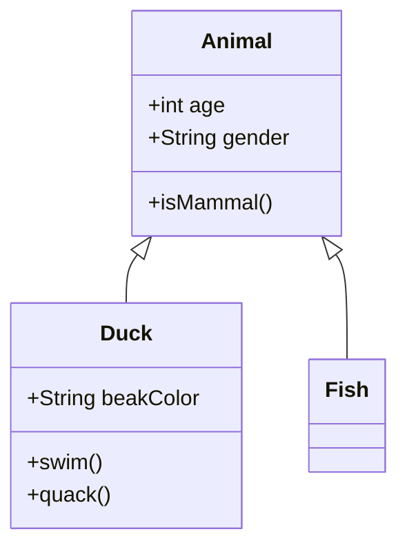
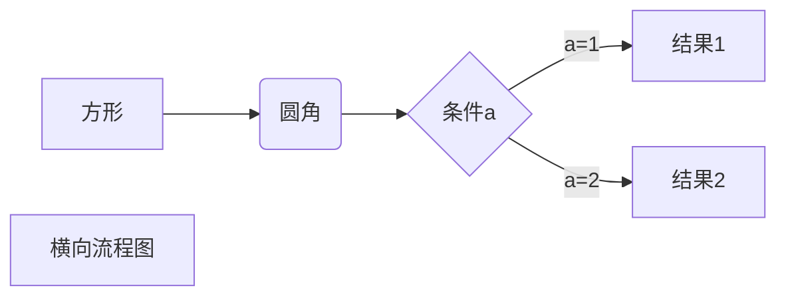
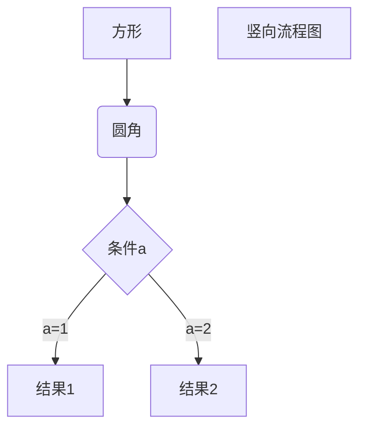
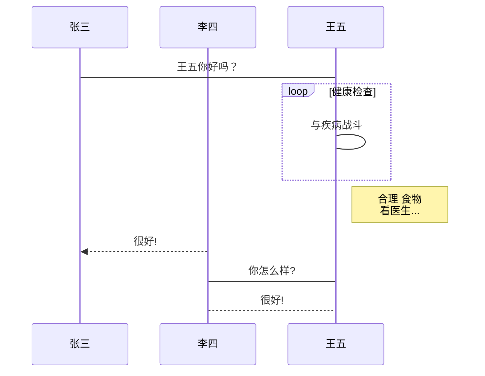
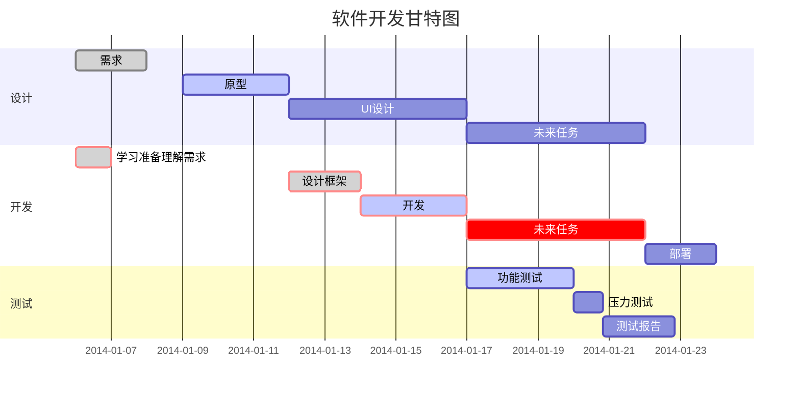
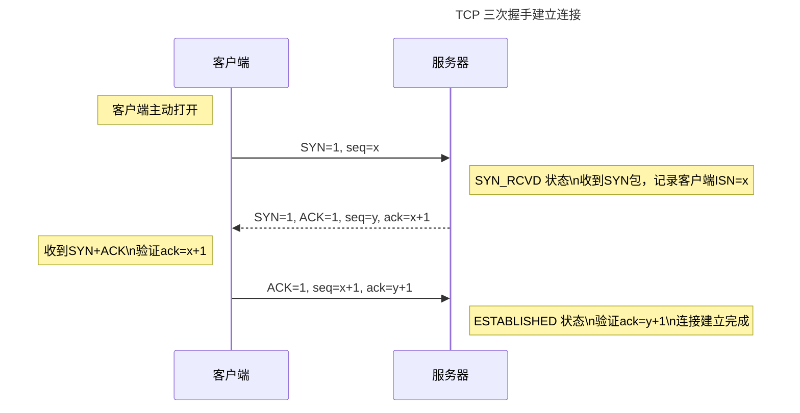
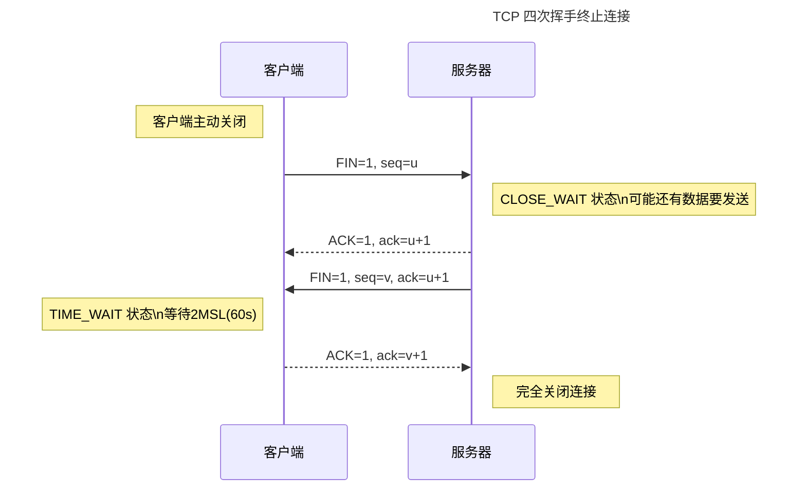
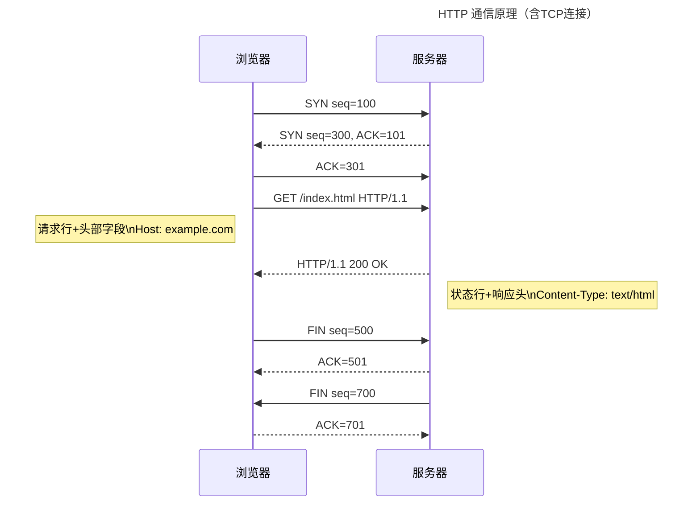
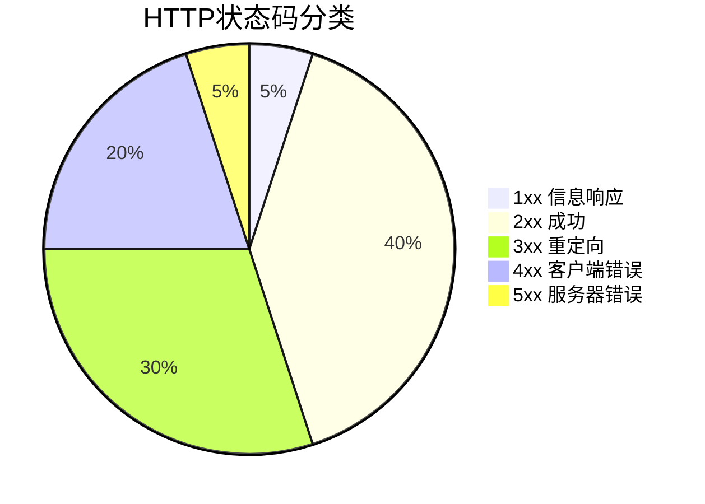
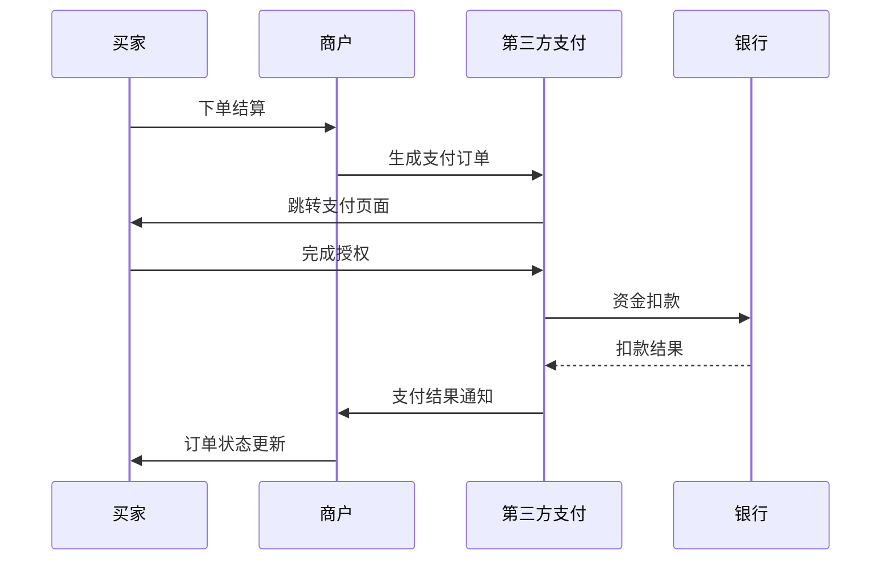

本文整理 Markdown 中常用的 Mermaid 图表语法，涵盖流程图、时序图、甘特图、类图等，并附有 TCP 握手、HTTP 通信等实际案例。

## Mermaid 图表语法参考

### 语法简介

#### 流程图（Flowchart）

- 方向声明：`TD`(上下)/`LR`(左右)
- 节点类型：
  - `[文本]` 矩形
  - `(文本)` 圆角矩形
  - `((文本))` 圆形
  - `{文本}` 菱形
- 连接线：
  - `-->` 实线箭头
  - `-.->` 虚线箭头
  - `==>` 加粗箭头

#### 序列图（Sequence Diagram）

**语法要点**：

- `participant` 定义参与者
- 消息类型：
  - `->>` 同步请求
  - `-->>` 异步响应
  - `-x` 失败消息
- 逻辑块：
  - `loop` 循环
  - `alt/else` 条件分支
  - `par` 并行

#### 类图（Class Diagram）

语法示例：



### 横向流程图



### 竖向流程图



### 标准流程图


以下 `flow` 语法为 Typora 专有扩展，Hugo / Hextra 不支持渲染，仅供语法参考。


```text
st=>start: 开始框
op=>operation: 处理框
cond=>condition: 判断框(是或否?)
sub1=>subroutine: 子流程
io=>inputoutput: 输入输出框
e=>end: 结束框

st->op->cond
cond(yes)->io->e
cond(no)->sub1(right)->op
```

#### 标准流程图（横向）

```text
st=>start: 开始框
op=>operation: 处理框
cond=>condition: 判断框(是或否?)
sub1=>subroutine: 子流程
io=>inputoutput: 输入输出框
e=>end: 结束框

st(right)->op(right)->cond
cond(yes)->io(bottom)->e
cond(no)->sub1(right)->op
```

### UML 时序图


以下 `sequence` 语法为 Typora 专有扩展，Hugo / Hextra 不支持渲染，仅供语法参考。标准 Mermaid 时序图见下方「UML 标准时序」节。


```text
对象A->对象B: 对象B你好吗?（请求）
Note right of 对象B: 对象B的描述
Note left of 对象A: 对象A的描述(提示)
对象B-->对象A: 我很好(响应)
对象A->对象B: 你真的好吗？
```

**UML 时序图复杂样例：**

```text
Title: 标题：复杂使用
对象A->对象B: 对象B你好吗?（请求）
Note right of 对象B: 对象B的描述
Note left of 对象A: 对象A的描述(提示)
对象B-->对象A: 我很好(响应)
对象B->小三: 你好吗
小三-->>对象A: 对象B找我了
对象A->对象B: 你真的好吗？
Note over 小三,对象B: 我们是朋友
participant C
Note right of C: 没人陪我玩
```

### UML标准时序



### 甘特图



### TCP三次握手



### TCP四次挥手



### HTTP请求



### 饼状图



### 三方支付流程图



