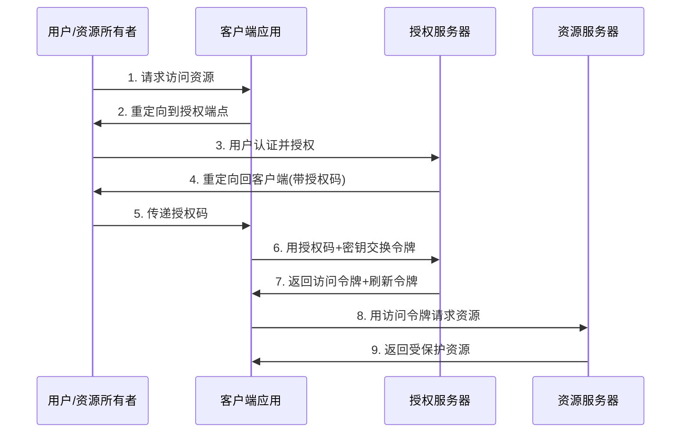
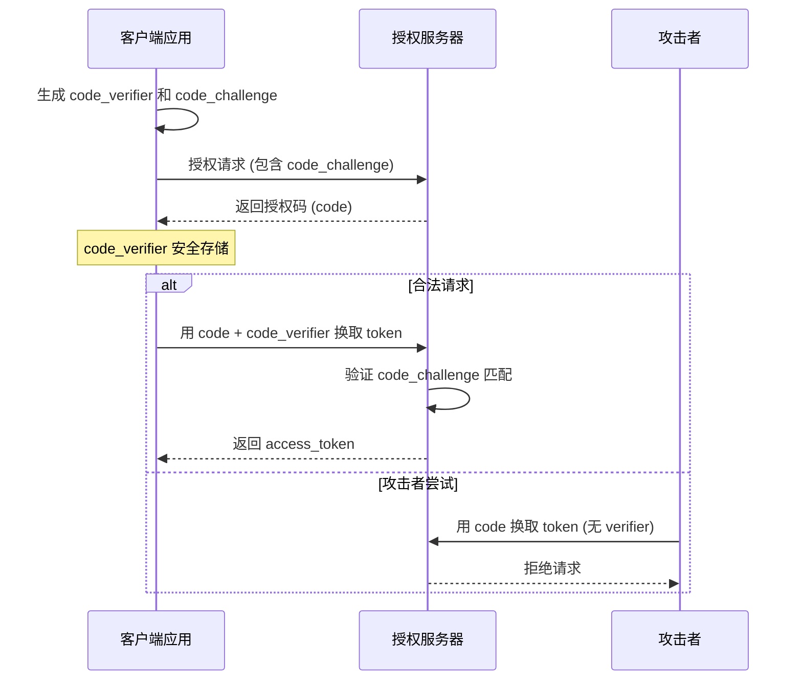

---
title: "OAuth2 授权"
weight: 20
date: 2026-06-05
tags: ["Go", "OAuth2", "认证", "JWT"]
---

## 什么是OAuth 2

OAuth 2.0 是一个**授权框架**，允许第三方应用程序在用户授权的前提下，**有限访问**用户在资源服务器上的受保护资源，而无需共享用户凭证。


### 核心角色

OAuth 2.0定义了四个角色：

- 资源所有者（Resource Owner）：能够授权访问受保护资源的实体。通常是用户。

- 客户端（Client）：代表资源所有者发起请求的应用程序，它需要访问受保护资源。

- 授权服务器（Authorization Server）：在验证资源所有者并获得授权后，向客户端颁发访问令牌（Access Token）。

- 资源服务器（Resource Server）：托管受保护资源的服务器，能够接受并响应使用访问令牌的资源请求。


### 授权类型（Grant Types）

OAuth 2.0定义了多种授权类型，以适应不同的客户端类型和场景：

- 授权码（Authorization Code）：适用于有后端的Web应用，是最安全的流程。

- 隐式（Implicit）：适用于纯前端应用（如单页应用），但安全性较低，不推荐使用，已被PKCE替代。

- 资源所有者密码凭证（Resource Owner Password Credentials）：用户直接将用户名密码交给客户端，仅适用于高度信任的客户端（如官方应用）。

- 客户端凭证（Client Credentials）：客户端以自己的名义而不是用户的名义访问资源，适用于机器对机器的场景。

- 刷新令牌（Refresh Token）：用于获取新的访问令牌，而不需要用户再次授权。


### 实现流程

1. **用户访问客户端**：用户通过客户端（如第三方应用）发起操作，客户端需要访问用户在资源服务器上的资源。
2. **客户端重定向用户到授权服务器**：客户端将用户重定向到授权服务器的授权端点（Authorization Endpoint），并附带以下参数：

   \- `response_type=code`：表示请求授权码。

   \- `client_id`：客户端的标识符。

   \- `redirect_uri`：授权服务器在授权后重定向用户回到客户端的地址。

   \- `scope`：请求的权限范围。

   \- `state`：客户端生成的随机字符串，用于防止CSRF攻击。

3. **用户认证与授权**：授权服务器提示用户登录（如果需要）并询问用户是否授权客户端访问所请求的资源。
4. **授权服务器重定向用户回客户端**：如果用户同意授权，授权服务器将用户重定向到客户端指定的`redirect_uri`，并附带一个授权码（`code`）和之前传入的`state`参数。
5. **客户端获取访问令牌**：客户端在后端使用授权码向授权服务器的令牌端点（Token Endpoint）发起请求，附带以下参数：

   \- `grant_type=authorization_code`

   \- `code`：上一步获取的授权码。

   \- `redirect_uri`：必须与第二步中使用的`redirect_uri`一致。

   \- `client_id`和`client_secret`：客户端的凭证（用于认证客户端自身）。

6. **授权服务器验证请求并返回访问令牌**：授权服务器验证授权码、客户端凭证和重定向URI，验证通过后返回访问令牌（Access Token）和可选的刷新令牌（Refresh Token）。
7. **客户端访问资源**：客户端使用访问令牌向资源服务器请求受保护的资源。
8. **资源服务器验证令牌并返回资源**：资源服务器验证访问令牌的有效性（如签名、有效期等），验证通过后返回资源。
9. **返回资源**




## 什么是PKCE

PKCE（Proof Key for Code Exchange，发音为“pixy”）是OAuth 2.0的一个扩展，主要用于防止授权码拦截攻击（Authorization Code Interception Attack）。这种攻击通常发生在攻击者能够截获授权服务器返回的授权码（authorization code）的情况下。PKCE通过引入一个由客户端创建的临时密钥（code_verifier）以及其变换值（code_challenge）来增强安全性。





## PKCE如何工作

- 客户端在启动授权请求时，生成一个随机的`code_verifier`（一个高熵的字符串），然后通过某种变换（如SHA256）生成`code_challenge`。

- 在授权请求中，客户端发送`code_challenge`和变换方法（如S256）给授权服务器。

- 授权服务器保存`code_challenge`和变换方法。

- 当授权服务器通过重定向返回授权码给客户端时，客户端在向令牌端点请求令牌时，必须同时提供授权码和原始的`code_verifier`。

- 授权服务器使用之前保存的变换方法对`code_verifier`进行变换，得到的结果与之前保存的`code_challenge`进行比较。如果匹配，则发放令牌。

##  PKCE为什么安全

即使攻击者截获了授权码，由于他们没有原始的`code_verifier`，他们无法在令牌端点换取令牌。因为授权服务器会要求同时提供授权码和`code_verifier`，而攻击者无法得知`code_verifier`（它并没有在网络中传输，只传输了`code_challenge`）。

那么，`code_verifier`存放在哪里？在传统的Web应用中（有后端），`code_verifier`是存放在后端的会话存储中的，而授权码是通过前端重定向传递到后端的。攻击者虽然可以在浏览器中看到授权码，但他们无法获取到后端的`code_verifier`（因为后端是受保护的）。在单页应用（SPA）中，`code_verifier`通常存放在浏览器的内存中（例如，JavaScript变量），并在换取令牌时使用。虽然攻击者可能通过XSS攻击获取内存中的`code_verifier`，但这已经超出了PKCE的防护范围（PKCE主要解决的是授权码拦截问题，而不是客户端本身的漏洞）。


## PKCE 的真实安全意义

1. 防止授权码拦截攻击

- 解决 OAuth 2.0 中授权码通过重定向传递可能被拦截的问题
- 即使攻击者截获授权码，也无法换取访问令牌

2. 客户端认证增强

- 为公共客户端（如SPA）提供类似机密客户端的保护级别
- 不需要客户端密钥，避免密钥泄露风险

3. 抵御重放攻击

- code_verifier 是一次性的
- 授权服务器会拒绝重复使用的 code_verifier

4. 绑定客户端会话

- 确保发起认证请求和完成认证的是同一客户端
- 防止跨站点请求伪造(CSRF)


## PKCE 之外的 OAuth 安全增强方案


### 1. 令牌绑定 (Token Binding)

- **原理**：将令牌绑定到TLS会话密钥

- **作用**：防止令牌被窃取后在其他设备使用

- **实现**：

  ```http
  GET /resource HTTP/1.1
  Authorization: Bearer ACCESS_TOKEN
  Sec-Token-Binding: AAwBAAc...
  ```


### 2. 互TLS客户端认证 (mTLS)

- **原理**：客户端和服务器双向TLS认证

- **作用**：防止令牌泄露后被未授权客户端使用

- **实现**：

  ```go
  // Go实现mTLS客户端
  cert, _ := tls.LoadX509KeyPair("client.crt", "client.key")
  config := &tls.Config{Certificates: []tls.Certificate{cert}}
  client := &http.Client{Transport: &http.Transport{TLSClientConfig: config}}
  ```


### 3. 令牌自省 (Token Introspection)

- **原理**：资源服务器实时验证令牌有效性

- **作用**：防止使用已撤销的令牌

- **RFC 7662** 标准：

  ```http
  POST /introspect HTTP/1.1
  Content-Type: application/x-www-form-urlencoded
  token=ACCESS_TOKEN&token_type_hint=access_token
  ```


### 4. 令牌撤销 (Token Revocation)

- **原理**：允许客户端主动撤销令牌

- **作用**：及时终止已泄露令牌

- **RFC 7009** 标准：

  ```http
  POST /revoke HTTP/1.1
  Content-Type: application/x-www-form-urlencoded
  token=ACCESS_TOKEN&token_type_hint=access_token
  ```


### 5. 安全事件推送 (Security Event Token - SET)

- **原理**：实时推送安全事件（如密码更改、令牌撤销）

- **作用**：及时响应账户安全事件

- **RFC 8417** 标准：

  ```json
  {
    "iss": "https://auth.server.com",
    "aud": "https://client.app.com",
    "iat": 1600000000,
    "jti": "bWJq",
    "events": {
      "https://schemas.openid.net/secevent/oauth/revocation": {
        "subject": {
          "client_id": "client123"
        }
      }
    }
  }
  ```


### 6. JWT安全增强

- **令牌类型**：使用JWT格式的访问令牌
- **安全措施**：
  - **签名验证**：防止篡改
  - **时效控制**：短有效期(15-30分钟)
  - **受众声明**：明确令牌使用范围
  - **颁发者验证**：确保来源可信


### 7. 动态客户端注册管理

- **原理**：自动管理客户端元数据
- **安全措施**：
  - 客户端元数据签名
  - 软件声明(Software Statements)
  - 客户端配置端点