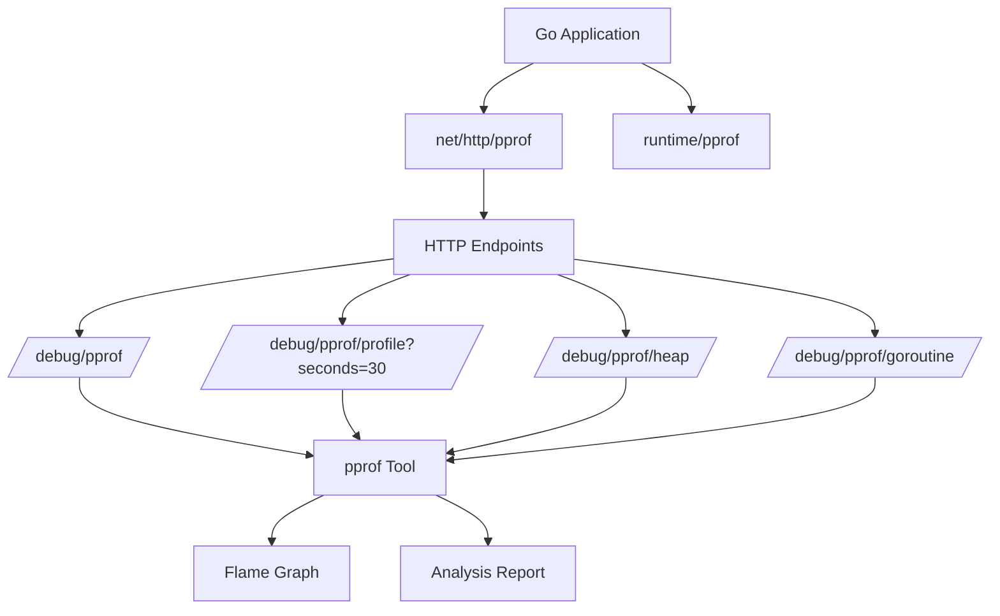

---
title: "pprof 性能分析"
weight: 30
date: 2026-06-05
tags: ["Go", "pprof", "性能", "profiling"]
---

## 1. pprof 模块概述

pprof 是 Go 语言内置的性能分析工具，用于分析程序的 CPU 使用率、内存分配、阻塞情况等。它可以帮助开发者快速定位性能瓶颈。

### 架构图




## 2. 启用 pprof

### 2.1 在 HTTP 服务中启用

```go
package main

import (
    "log"
    "net/http"
    _ "net/http/pprof" // 自动注册 pprof 路由
)

func main() {
    // 业务路由
    http.HandleFunc("/api/user", userHandler)
    http.HandleFunc("/api/order", orderHandler)
    
    // 在 6060 端口启动服务，pprof 路由会自动注册
    log.Println("Server starting on :6060")
    log.Fatal(http.ListenAndServe(":6060", nil))
}

func userHandler(w http.ResponseWriter, r *http.Request) {
    // 模拟业务逻辑
    time.Sleep(100 * time.Millisecond)
    w.Write([]byte("User data"))
}

func orderHandler(w http.ResponseWriter, r *http.Request) {
    // 模拟资源密集型操作
    data := make([]byte, 10 * 1024 * 1024) // 分配 10MB 内存
    w.Write(data)
}
```

### 2.2 代码解释：

- •

  `import _ "net/http/pprof"`：通过空导入自动注册 pprof 的 HTTP 路由

- •

  pprof 会自动注册以下路由：

  - •

    `/debug/pprof/`：pprof 主页面

  - •

    `/debug/pprof/profile`：CPU 性能分析

  - •

    `/debug/pprof/heap`：内存分配分析

  - •

    `/debug/pprof/goroutine`：Goroutine 分析

  - •

    `/debug/pprof/block`：阻塞分析

## 3. 性能数据收集与分析

### 3.1 收集 CPU 使用率数据

```bash
# 采集 30 秒的 CPU 使用数据
go tool pprof http://localhost:6060/debug/pprof/profile?seconds=30

# 使用 top 命令查看最耗 CPU 的函数
(pprof) top 10

# 生成火焰图
go tool pprof -http=:8080 http://localhost:6060/debug/pprof/profile?seconds=30
```

### 3.2 收集内存分配数据

```bash
# 分析堆内存分配
go tool pprof http://localhost:6060/debug/pprof/heap

# 查看内存分配最多的函数
(pprof) top 10 -alloc_space

# 查看内存占用最多的函数
(pprof) top 10 -inuse_space
```

### 3.3 分析 Goroutine

```bash
# 分析 Goroutine 情况
go tool pprof http://localhost:6060/debug/pprof/goroutine

# 查看 Goroutine 数量
(pprof) top
```

## 4. 自动化性能测试方案

### 4.1 压力测试脚本 (使用 wrk)

```bash
#!/bin/bash
# performance_test.sh

# 测试用户接口
wrk -t12 -c400 -d30s http://localhost:6060/api/user

# 测试订单接口
wrk -t12 -c400 -d30s http://localhost:6060/api/order
```

### 4.2 性能监控脚本

```go
package main

import (
    "fmt"
    "io"
    "net/http"
    "os"
    "time"
)

func collectProfiles() {
    endpoints := map[string]string{
        "cpu":    "/debug/pprof/profile?seconds=30",
        "heap":   "/debug/pprof/heap",
        "goroutine": "/debug/pprof/goroutine",
    }

    for name, endpoint := range endpoints {
        resp, err := http.Get("http://localhost:6060" + endpoint)
        if err != nil {
            fmt.Printf("Error collecting %s: %v\n", name, err)
            continue
        }
        
        file, err := os.Create(fmt.Sprintf("%s_%s.pprof", name, time.Now().Format("20060102_150405")))
        if err != nil {
            resp.Body.Close()
            fmt.Printf("Error creating file: %v\n", err)
            continue
        }
        
        io.Copy(file, resp.Body)
        file.Close()
        resp.Body.Close()
        
        fmt.Printf("Collected %s profile\n", name)
    }
}

func main() {
    // 每小时收集一次性能数据
    ticker := time.NewTicker(1 * time.Hour)
    defer ticker.Stop()
    
    for {
        select {
        case <-ticker.C:
            collectProfiles()
        }
    }
}
```

## 5. 性能数据分析示例

### 5.1 识别慢接口

```bash
# 1. 启动压力测试
./performance_test.sh

# 2. 收集 CPU 性能数据
go tool pprof http://localhost:6060/debug/pprof/profile?seconds=30

# 3. 分析结果
(pprof) top 10 -cum
# 显示累积耗时最多的函数
```

### 5.2 识别资源占用高的接口

```bash
# 1. 运行测试后收集堆内存数据
go tool pprof http://localhost:6060/debug/pprof/heap

# 2. 分析内存分配
(pprof) top 10 -alloc_space
# 显示内存分配最多的函数
```

## 6. 高级分析技巧

### 6.1 比较两次性能数据

```bash
# 收集基准数据
go tool pprof -base base.pprof current.pprof

# 在 web 界面中查看差异
go tool pprof -http=:8080 -diff_base base.pprof current.pprof
```

### 6.2 自动化性能报告

```go
package main

import (
    "os"
    "os/exec"
    "time"
)

func generatePerformanceReport() {
    // 生成 CPU 火焰图
    exec.Command("go", "tool", "pprof", "-http=:8081", "-seconds=30", 
        "http://localhost:6060/debug/pprof/profile").Run()
    
    // 生成内存报告
    exec.Command("go", "tool", "pprof", "-text", "-alloc_space",
        "http://localhost:6060/debug/pprof/heap").Output()
    
    // 保存时间序列数据用于 Grafana 展示
    saveTimeSeriesData()
}

func saveTimeSeriesData() {
    // 这里可以集成 Prometheus 或自定义指标收集
    // 示例：记录接口响应时间、内存使用率等
}
```

## 7. Grafana 监控展示

### 7.1 性能指标监控面板

建议监控以下指标：

- •

  接口响应时间（P50, P90, P99）

- •

  CPU 使用率

- •

  内存分配率

- •

  Goroutine 数量

- •

  GC 暂停时间

### 7.2 性能对比数据示例

```bash
# 优化前性能数据
API /api/user: 
- Average latency: 120ms
- P99 latency: 450ms
- Memory allocation: 5MB/request

# 优化后性能数据
API /api/user:
- Average latency: 45ms  
- P99 latency: 120ms
- Memory allocation: 1.2MB/request
```

## 8. 安全审计要点

1. 1.

   **生产环境访问控制**：

   ```go
   // 在生产环境中限制 pprof 访问
   func authMiddleware(next http.Handler) http.Handler {
       return http.HandlerFunc(func(w http.ResponseWriter, r *http.Request) {
           if strings.HasPrefix(r.URL.Path, "/debug/pprof") {
               // 验证身份认证
               if !isAuthenticated(r) {
                   http.Error(w, "Forbidden", http.StatusForbidden)
                   return
               }
           }
           next.ServeHTTP(w, r)
       })
   }
   ```

2. 2.

   **监控数据加密**：确保性能数据传输加密

## 9. 单元测试示例

```go
package main

import (
    "net/http"
    "net/http/httptest"
    "testing"
    "time"
)

func TestUserHandlerPerformance(t *testing.T) {
    req := httptest.NewRequest("GET", "/api/user", nil)
    rr := httptest.NewRecorder()
    
    start := time.Now()
    userHandler(rr, req)
    duration := time.Since(start)
    
    if duration > 200*time.Millisecond {
        t.Errorf("Handler took too long: %v", duration)
    }
    
    if rr.Code != http.StatusOK {
        t.Errorf("Expected status 200, got %d", rr.Code)
    }
}
```

## 10. 总结建议

1. 1.

   **定期性能分析**：建议每周至少进行一次全面的性能分析

2. 2.

   **基准测试**：建立性能基准，监控性能回归

3. 3.

   **自动化集成**：将性能测试集成到 CI/CD 流程中

4. 4.

   **渐进式优化**：每次只优化一个瓶颈点，验证效果后再继续

通过以上方法，你可以系统地分析 Go 项目中接口的响应速度和资源占用情况，并持续优化性能。