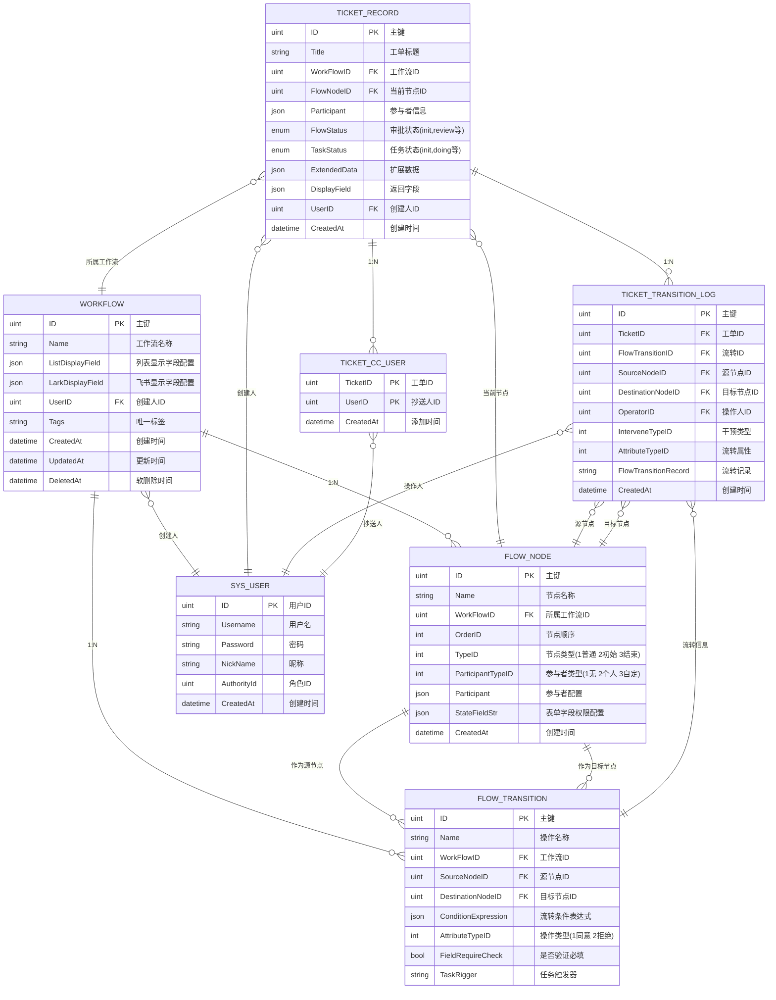
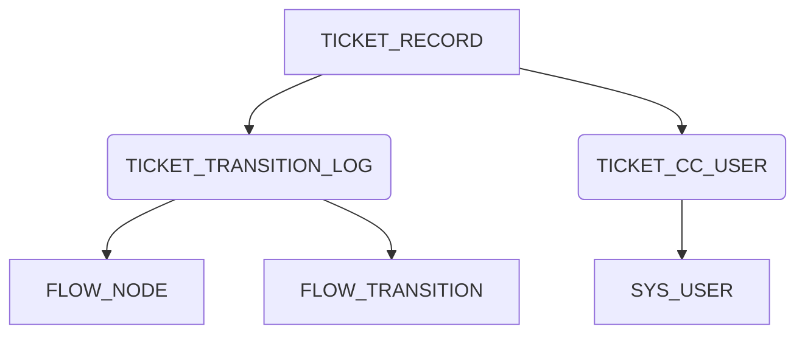
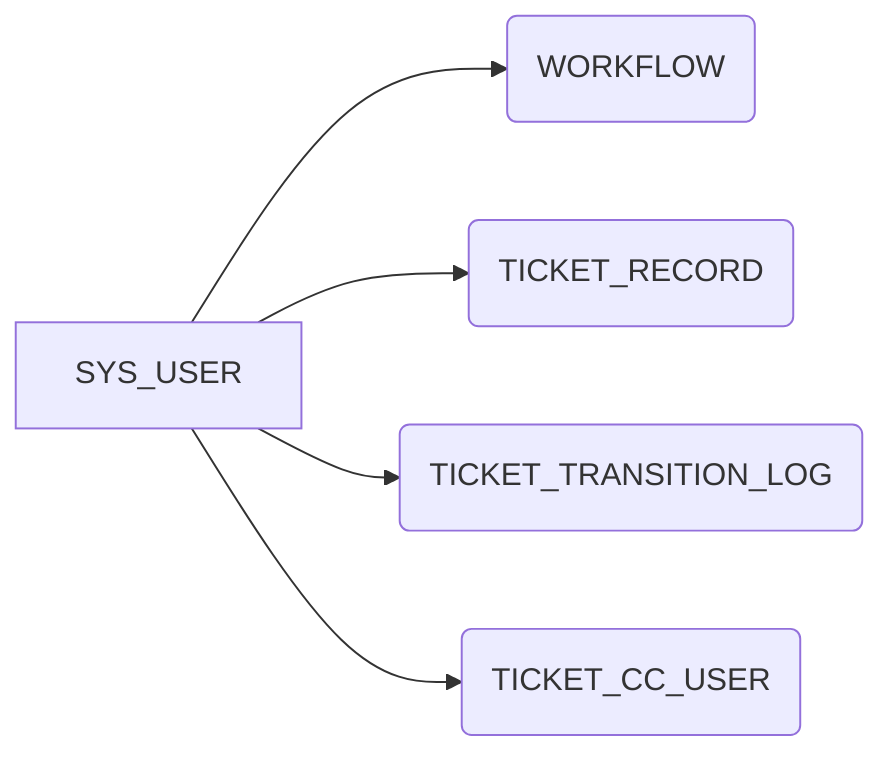

---
title: "工作流模型设计"
weight: 40
date: 2026-06-05
tags: ["Go", "工作流", "架构设计"]
---

## 动态工作流表模型设计

```GO
package workflow

import (
	"gorm.io/gorm"
	"time"
)

// 自定义表名
const (
	FlowTableName                = "workflow_base"                  // 工作流主表
	FlowNodeTableName            = "workflow_flow_node"             // 工作流节点表
	FlowTransitionTableName      = "workflow_flow_transition"       // 工作流流转信息表
	TicketRecordTableName        = "workflow_ticket_record"         // 工单信息表
	TicketTransitionLogTableName = "workflow_ticket_transition_log" // 工单流转日志表
	TicketCCListTableName        = "workflow_ticket_cc_users"
)

// FlowStatus 审批状态枚举
type FlowStatus string

const (
	FlowStatusInit     FlowStatus = "init"
	FlowStatusReview   FlowStatus = "review"
	FlowStatusAgree    FlowStatus = "agree"
	FlowStatusRefuse   FlowStatus = "refuse"
	FlowStatusRollback FlowStatus = "rollback"
	FlowStatusCancel   FlowStatus = "cancel"
)

// TaskStatus 任务状态枚举
type TaskStatus string

const (
	TaskStatusInit    TaskStatus = "init"
	TaskStatusDoing   TaskStatus = "doing"
	TaskStatusSuccess TaskStatus = "success"
	TaskStatusError   TaskStatus = "error"
)

// BaseModel 公共嵌入结构体，包含通用字段
type BaseModel struct {
	ID          uint           `gorm:"column:id;primaryKey;autoIncrement:true;comment:主键" json:"id"`                                          // 软删除标记
	CreatedAt   time.Time      `gorm:"column:created_at;not null;autoCreateTime;default:CURRENT_TIMESTAMP(3);comment:创建时间" json:"created_at"` // 创建时间
	UpdatedAt   time.Time      `gorm:"column:updated_at;not null;autoUpdateTime;default:CURRENT_TIMESTAMP(3);comment:更新时间" json:"updated_at"` // 更新时间
	DeletedAt   gorm.DeletedAt `gorm:"column:deleted_at;index;comment:软删除时间" json:"deleted_at"`                                               // 软删除时间
	Description string         `gorm:"type:varchar(256); column:description;comment: 备注信息" json:"description"`                                //  备注信息

}

```


### 模型字段详细说明

#### 1. 工作流主表

```go
package workflow

import (
	"github.com/flipped-aurora/gin-vue-admin/server/model/system"
	"gorm.io/datatypes"
)

// WorkFlow 工作流主表
type WorkFlow struct {
	BaseModel
	Name             string         `gorm:"type:varchar(64);not null;uniqueIndex:idx_workflow_name;comment:工作流名称" json:"name" form:"name" query:"name"` // 流程名称
	ListDisplayField datatypes.JSON `gorm:"type:json;comment:需要返回的数据库字段" json:"list_display_field" form:"list_display_field"`                           // 列表显示字段配置
	LarkDisplayField datatypes.JSON `gorm:"type:json;comment:飞书三方审批返回字段" json:"lark_display_field" form:"lark_display_field"`                           // 飞书显示字段配置
	UserID           uint           `gorm:"type:int;comment:创建人" json:"user_id" form:"user_id" query:"user_id"`                                         // 创建人ID
	Tags             string         `gorm:"type:varchar(64);uniqueIndex:idx_workflow_tags;comment:标签" json:"tags" form:"tags" query:"tags"`             // 唯一标签标识

	// 关联关系
	FlowNodes       []FlowNode       `gorm:"foreignKey:WorkFlowID;references:ID" json:"flow_nodes"`
	FlowTransitions []FlowTransition `gorm:"foreignKey:WorkFlowID;references:ID" json:"flow_transitions"`
	CreatUser       system.SysUser   `gorm:"foreignKey:UserID;references:ID" json:"creat_user"`
}

func (*WorkFlow) TableName() string {
	return FlowTableName
}

```


```sql
CREATE TABLE `gva`.`workflow_base`  (
  `id` bigint(20) UNSIGNED NOT NULL AUTO_INCREMENT COMMENT '主键',
  `created_at` datetime(3) NOT NULL DEFAULT CURRENT_TIMESTAMP(3) COMMENT '创建时间',
  `updated_at` datetime(3) NOT NULL DEFAULT CURRENT_TIMESTAMP(3) COMMENT '更新时间',
  `deleted_at` datetime(3) NULL DEFAULT NULL COMMENT '软删除时间',
  `description` varchar(256) CHARACTER SET utf8mb4 COLLATE utf8mb4_0900_ai_ci NULL DEFAULT NULL COMMENT ' 备注信息',
  `name` varchar(64) CHARACTER SET utf8mb4 COLLATE utf8mb4_0900_ai_ci NOT NULL COMMENT '工作流名称',
  `list_display_field` json NULL COMMENT '需要返回的数据库字段',
  `lark_display_field` json NULL COMMENT '飞书三方审批返回字段',
  `user_id` bigint(20) UNSIGNED NULL DEFAULT NULL COMMENT '创建人',
  `tags` varchar(64) CHARACTER SET utf8mb4 COLLATE utf8mb4_0900_ai_ci NULL DEFAULT NULL COMMENT '标签',
  PRIMARY KEY (`id`) USING BTREE,
  UNIQUE INDEX `idx_workflow_name`(`name` ASC) USING BTREE,
  UNIQUE INDEX `idx_workflow_tags`(`tags` ASC) USING BTREE,
  INDEX `idx_workflow_base_deleted_at`(`deleted_at` ASC) USING BTREE
) ENGINE = InnoDB CHARACTER SET = utf8mb4 COLLATE = utf8mb4_0900_ai_ci ROW_FORMAT = Dynamic;
```


|      字段名      |   类型   |       含义       |    备注    |
| :--------------: | :------: | :--------------: | :--------: |
|        ID        |   uint   |       主键       |    自增    |
|       Name       |  string  |    工作流名称    |  唯一索引  |
| ListDisplayField |   json   | 列表显示字段配置 | 页面展示用 |
| LarkDisplayField |   json   | 飞书显示字段配置 | 飞书集成用 |
|      UserID      |   uint   |     创建人ID     | 关联用户表 |
|       Tags       |  string  |     唯一标签     |  唯一索引  |
|    CreatedAt     | datetime |     创建时间     |            |
|    UpdatedAt     | datetime |     更新时间     |            |
|    DeletedAt     | datetime |    软删除时间    |            |


#### 2. 审批节点表

```go
package workflow

import (
	"gorm.io/datatypes"
)

// FlowNode 审批节点表
type FlowNode struct {
	BaseModel
	Name              string         `gorm:"type:varchar(64);not null;comment:节点名称" json:"name" form:"name" query:"name"`
	WorkFlowID        uint           `gorm:"type:int;index;comment:工作流ID" json:"work_flow_id" form:"work_flow_id" query:"work_flow_id"` // 外键字段关联WorkFlow审批流程表
	OrderID           int            `gorm:"type:int;comment:状态顺序" json:"order_id" form:"order_id"`                                     // 节点顺序
	TypeID            int            `gorm:"type:int;default:0;comment:状态类型ID" json:"type_id" form:"type_id"`                           // 1.普通类型 2.初始状态 3.结束状态
	ParticipantTypeID int            `gorm:"type:int;default:1;comment:参与者类型ID" json:"participant_type_id" form:"participant_type_id"`  // 1.无处理人  2.个人/多人  3.自定义  4.条件表达式
	Participant       datatypes.JSON `gorm:"type:json;comment:参与者" json:"participant" form:"participant"`                               // 参与者配置
	StateFieldStr     datatypes.JSON `gorm:"type:json;not null;comment:表单字段" json:"state_field_str" form:"state_field_str"`             // 字段权限配置

	// 关联关系
	WorkFlow          WorkFlow         `gorm:"foreignKey:WorkFlowID;references:ID" json:"work_flow"`
	SourceTransitions []FlowTransition `gorm:"foreignKey:SourceNodeID;references:ID" json:"source_transitions"`
	TargetTransitions []FlowTransition `gorm:"foreignKey:DestinationNodeID;references:ID" json:"target_transitions"`
}

func (*FlowNode) TableName() string {
	return FlowNodeTableName
}


```

```sql
CREATE TABLE `gva`.`workflow_flow_node`  (
  `id` bigint(20) UNSIGNED NOT NULL AUTO_INCREMENT COMMENT '主键',
  `created_at` datetime(3) NOT NULL DEFAULT CURRENT_TIMESTAMP(3) COMMENT '创建时间',
  `updated_at` datetime(3) NOT NULL DEFAULT CURRENT_TIMESTAMP(3) COMMENT '更新时间',
  `deleted_at` datetime(3) NULL DEFAULT NULL COMMENT '软删除时间',
  `description` varchar(256) CHARACTER SET utf8mb4 COLLATE utf8mb4_0900_ai_ci NULL DEFAULT NULL COMMENT ' 备注信息',
  `name` varchar(64) CHARACTER SET utf8mb4 COLLATE utf8mb4_0900_ai_ci NOT NULL COMMENT '节点名称',
  `work_flow_id` bigint(20) UNSIGNED NULL DEFAULT NULL COMMENT '工作流ID',
  `order_id` bigint(20) NULL DEFAULT NULL COMMENT '状态顺序',
  `type_id` bigint(20) NULL DEFAULT 0 COMMENT '状态类型ID',
  `participant_type_id` bigint(20) NULL DEFAULT 1 COMMENT '参与者类型ID',
  `participant` json NULL COMMENT '参与者',
  `state_field_str` json NOT NULL COMMENT '表单字段',
  PRIMARY KEY (`id`) USING BTREE,
  INDEX `idx_workflow_flow_node_deleted_at`(`deleted_at` ASC) USING BTREE,
  INDEX `idx_workflow_flow_node_work_flow_id`(`work_flow_id` ASC) USING BTREE
) ENGINE = InnoDB CHARACTER SET = utf8mb4 COLLATE = utf8mb4_0900_ai_ci ROW_FORMAT = Dynamic;
```


|      字段名       |   类型   |       含义       |          备注          |
| :---------------: | :------: | :--------------: | :--------------------: |
|        ID         |   uint   |       主键       |          自增          |
|       Name        |  string  |     节点名称     |                        |
|    WorkFlowID     |   uint   |   所属工作流ID   |          外键          |
|      OrderID      |   int    |     节点顺序     |         排序用         |
|      TypeID       |   int    |     节点类型     |  1:普通 2:初始 3:结束  |
| ParticipantTypeID |   int    |    参与者类型    | 1:无处理人 2:个人/多人 |
|    Participant    |   json   |    参与者配置    |        JSON格式        |
|   StateFieldStr   |   json   | 表单字段权限配置 |      控制字段读写      |
|     CreatedAt     | datetime |     创建时间     |                        |


#### 3. 流程流转表

```go
package workflow

import (
	"gorm.io/datatypes"
)

// FlowTransition 流程流转表
type FlowTransition struct {
	BaseModel
	Name                string         `gorm:"type:varchar(32);not null;comment:操作名称" json:"name" form:"name" query:"name"`
	WorkFlowID          uint           `gorm:"type:int;index;comment:工作流ID" json:"work_flow_id" form:"work_flow_id" query:"work_flow_id"`      // 工作流ID 外键字段关联WorkFlow表
	SourceNodeID        uint           `gorm:"type:int;index;comment:源节点ID" json:"source_node_id" form:"source_node_id"`                       // 源状态节点 外键字段关联FlowNode表
	DestinationNodeID   uint           `gorm:"type:int;index;comment:目标节点ID" json:"destination_node_id" form:"destination_node_id"`            // 目标状态节点 外键字段关联FlowNode表
	ConditionExpression datatypes.JSON `gorm:"type:json;comment:流转条件表达式" json:"condition_expression" form:"condition_expression"`              // 流转条件表达式 格式为[{"expression":"{days} > 3 and {days}<10", "target_state_id":11}]
	AttributeTypeID     int            `gorm:"type:int;default:1;comment:操作类型" json:"attribute_type_id" form:"attribute_type_id"`              // 操作类型 1.同意，2.拒绝，3.退回
	FieldRequireCheck   bool           `gorm:"type:boolean;default:true;comment:是否验证必填" json:"field_require_check" form:"field_require_check"` // 是否验证必填
	TaskRigger          string         `gorm:"type:varchar(256);comment:任务触发器" json:"task_rigger" form:"task_rigger"`                          // 任务触发器

	// 关联关系
	WorkFlow        WorkFlow `gorm:"foreignKey:WorkFlowID;references:ID" json:"work_flow"`
	SourceNode      FlowNode `gorm:"foreignKey:SourceNodeID;references:ID" json:"source_node"`
	DestinationNode FlowNode `gorm:"foreignKey:DestinationNodeID;references:ID" json:"destination_node"`
}

func (*FlowTransition) TableName() string {
	return FlowTransitionTableName
}


```

```sql
CREATE TABLE `gva`.`workflow_flow_transition`  (
  `id` bigint(20) UNSIGNED NOT NULL AUTO_INCREMENT COMMENT '主键',
  `created_at` datetime(3) NOT NULL DEFAULT CURRENT_TIMESTAMP(3) COMMENT '创建时间',
  `updated_at` datetime(3) NOT NULL DEFAULT CURRENT_TIMESTAMP(3) COMMENT '更新时间',
  `deleted_at` datetime(3) NULL DEFAULT NULL COMMENT '软删除时间',
  `description` varchar(256) CHARACTER SET utf8mb4 COLLATE utf8mb4_0900_ai_ci NULL DEFAULT NULL COMMENT ' 备注信息',
  `name` varchar(32) CHARACTER SET utf8mb4 COLLATE utf8mb4_0900_ai_ci NOT NULL COMMENT '操作名称',
  `work_flow_id` bigint(20) UNSIGNED NULL DEFAULT NULL COMMENT '工作流ID',
  `source_node_id` bigint(20) UNSIGNED NULL DEFAULT NULL COMMENT '源节点ID',
  `destination_node_id` bigint(20) UNSIGNED NULL DEFAULT NULL COMMENT '目标节点ID',
  `condition_expression` json NULL COMMENT '流转条件表达式',
  `attribute_type_id` bigint(20) NULL DEFAULT 1 COMMENT '操作类型',
  `field_require_check` tinyint(1) NULL DEFAULT 1 COMMENT '是否验证必填',
  `task_rigger` varchar(256) CHARACTER SET utf8mb4 COLLATE utf8mb4_0900_ai_ci NULL DEFAULT NULL COMMENT '任务触发器',
  PRIMARY KEY (`id`) USING BTREE,
  INDEX `idx_workflow_flow_transition_deleted_at`(`deleted_at` ASC) USING BTREE,
  INDEX `idx_workflow_flow_transition_work_flow_id`(`work_flow_id` ASC) USING BTREE,
  INDEX `idx_workflow_flow_transition_source_node_id`(`source_node_id` ASC) USING BTREE,
  INDEX `idx_workflow_flow_transition_destination_node_id`(`destination_node_id` ASC) USING BTREE
) ENGINE = InnoDB CHARACTER SET = utf8mb4 COLLATE = utf8mb4_0900_ai_ci ROW_FORMAT = Dynamic;
```


|       字段名        |   类型   |      含义      |         备注         |
| :-----------------: | :------: | :------------: | :------------------: |
|         ID          |   uint   |      主键      |         自增         |
|        Name         |  string  |    操作名称    |   如"同意"、"拒绝"   |
|     WorkFlowID      |   uint   |    工作流ID    |         外键         |
|    SourceNodeID     |   uint   |    源节点ID    |         外键         |
|  DestinationNodeID  |   uint   |   目标节点ID   |         外键         |
| ConditionExpression |   json   | 流转条件表达式 |     动态路由逻辑     |
|   AttributeTypeID   |   int    |    操作类型    | 1:同意 2:拒绝 3:退回 |
|  FieldRequireCheck  |   bool   |  是否验证必填  |       默认true       |
|     TaskRigger      |  string  |   任务触发器   |     触发任务逻辑     |
|      CreatedAt      | datetime |    创建时间    |                      |


#### 4. 工单实例表

```go
// TicketRecord 工单实例表
type TicketRecord struct {
	BaseModel
	Title        string         `gorm:"type:varchar(500);not null;comment:工单的标题" json:"title" form:"title" query:"title"`                           // 标题
	WorkFlowID   uint           `gorm:"type:int;index;comment:工作流ID" json:"work_flow_id" form:"work_flow_id" query:"work_flow_id"`                  // 外键字段关联WorkFlow审批流程表
	WorkflowType string         `gorm:"type:varchar(256);default:'';comment:工作流类型" json:"workflow_type" form:"workflow_type" query:"workflow_type"` // 工作流类型
	FlowNodeID   uint           `gorm:"type:int;index;comment:当前所在审批节点" json:"flow_node_id" form:"flow_node_id" query:"flow_node_id"`               // 外键字段关联FlowNode审批节点表
	Participant  datatypes.JSON `gorm:"type:json;comment:参与者" json:"participant" form:"participant"`                                                // 可以为空(无处理人的情况，如结束状态)，包含多个节点信息
	FlowStatus   FlowStatus     `gorm:"type:varchar(32);default:'init';comment:审批状态" json:"flow_status" form:"flow_status" query:"flow_status"`     // 审批状态
	TaskStatus   TaskStatus     `gorm:"type:varchar(10);default:'init';comment:任务执行状态" json:"task_status" form:"task_status" query:"task_status"`   // 任务状态
	ExtendedData datatypes.JSON `gorm:"type:json;comment:扩展数据" json:"extended_data" form:"extended_data"`                                           // 扩展数据
	DisplayField datatypes.JSON `gorm:"type:json;comment:返回字段" json:"display_field" form:"display_field"`                                           // 返回字段
	UserID       uint           `gorm:"type:int;comment:创建人" json:"user_id" form:"user_id" query:"user_id"`                                         // 创建人ID

	// 关联关系
	WorkFlow       WorkFlow              `gorm:"foreignKey:WorkFlowID;references:ID" json:"work_flow"`
	CurrentNode    FlowNode              `gorm:"foreignKey:FlowNodeID;references:ID" json:"current_node"`
	CreatUser      system.SysUser        `gorm:"foreignKey:UserID;references:ID" json:"creat_user"`
	TransitionLogs []TicketTransitionLog `gorm:"foreignKey:TicketID;references:ID" json:"transition_logs"`
	CCUsers        []system.SysUser      `gorm:"many2many:workflow_ticket_cc_users;" json:"cc_users"`
}

func (*TicketRecord) TableName() string {
	return TicketRecordTableName
}
```

```sql
CREATE TABLE `gva`.`workflow_ticket_record`  (
  `id` bigint(20) UNSIGNED NOT NULL AUTO_INCREMENT COMMENT '主键',
  `created_at` datetime(3) NOT NULL DEFAULT CURRENT_TIMESTAMP(3) COMMENT '创建时间',
  `updated_at` datetime(3) NOT NULL DEFAULT CURRENT_TIMESTAMP(3) COMMENT '更新时间',
  `deleted_at` datetime(3) NULL DEFAULT NULL COMMENT '软删除时间',
  `description` varchar(256) CHARACTER SET utf8mb4 COLLATE utf8mb4_0900_ai_ci NULL DEFAULT NULL COMMENT ' 备注信息',
  `title` varchar(500) CHARACTER SET utf8mb4 COLLATE utf8mb4_0900_ai_ci NOT NULL COMMENT '工单的标题',
  `work_flow_id` bigint(20) UNSIGNED NULL DEFAULT NULL COMMENT '工作流ID',
  `workflow_type` varchar(256) CHARACTER SET utf8mb4 COLLATE utf8mb4_0900_ai_ci NULL DEFAULT '' COMMENT '工作流类型',
  `flow_node_id` bigint(20) UNSIGNED NULL DEFAULT NULL COMMENT '当前所在审批节点',
  `participant` json NULL COMMENT '参与者',
  `flow_status` varchar(32) CHARACTER SET utf8mb4 COLLATE utf8mb4_0900_ai_ci NULL DEFAULT 'init' COMMENT '审批状态',
  `task_status` varchar(10) CHARACTER SET utf8mb4 COLLATE utf8mb4_0900_ai_ci NULL DEFAULT 'init' COMMENT '任务执行状态',
  `extended_data` json NULL COMMENT '扩展数据',
  `display_field` json NULL COMMENT '返回字段',
  `user_id` bigint(20) UNSIGNED NULL DEFAULT NULL COMMENT '创建人',
  PRIMARY KEY (`id`) USING BTREE,
  INDEX `idx_workflow_ticket_record_work_flow_id`(`work_flow_id` ASC) USING BTREE,
  INDEX `idx_workflow_ticket_record_flow_node_id`(`flow_node_id` ASC) USING BTREE,
  INDEX `idx_workflow_ticket_record_deleted_at`(`deleted_at` ASC) USING BTREE
) ENGINE = InnoDB CHARACTER SET = utf8mb4 COLLATE = utf8mb4_0900_ai_ci ROW_FORMAT = Dynamic;
```


|    字段名    |   类型   |    含义    |         备注         |
| :----------: | :------: | :--------: | :------------------: |
|      ID      |   uint   |    主键    |         自增         |
|    Title     |  string  |  工单标题  |                      |
|  WorkFlowID  |   uint   |  工作流ID  |         外键         |
|  FlowNodeID  |   uint   | 当前节点ID |         外键         |
| Participant  |   json   | 参与者信息 |      当前处理人      |
|  FlowStatus  |   enum   |  审批状态  | init/review/agree等  |
|  TaskStatus  |   enum   |  任务状态  | init/doing/success等 |
| ExtendedData |   json   |  扩展数据  |     表单数据存储     |
| DisplayField |   json   |  返回字段  |    展示用字段列表    |
|    UserID    |   uint   |  创建人ID  |         外键         |
|  CreatedAt   | datetime |  创建时间  |                      |


#### 5. 工单抄送人中间表 (TICKET_CC_USER)

```go
// TicketCCUser 工单抄送人中间表
type TicketCCUser struct {
	TicketID  uint      `gorm:"primaryKey;autoIncrement:false;comment:工单ID" json:"ticket_id" form:"ticket_id"`
	UserID    uint      `gorm:"primaryKey;autoIncrement:false;comment:用户ID" json:"user_id" form:"user_id"`
	CreatedAt time.Time `gorm:"default:CURRENT_TIMESTAMP(3);comment:添加时间" json:"created_at"`
	// 添加唯一约束
	UniqueConstraint string `gorm:"uniqueIndex:idx_ticket_user;type:varchar(64);default:''"`
}

func (*TicketCCUser) TableName() string {
	return TicketCCListTableName
}
```

```sql
CREATE TABLE `gva`.`workflow_ticket_cc_users`  (
  `ticket_id` bigint(20) UNSIGNED NOT NULL COMMENT '工单ID',
  `user_id` bigint(20) UNSIGNED NOT NULL COMMENT '用户ID',
  `created_at` datetime(3) NULL DEFAULT CURRENT_TIMESTAMP(3) COMMENT '添加时间',
  `unique_constraint` varchar(64) CHARACTER SET utf8mb4 COLLATE utf8mb4_0900_ai_ci NULL DEFAULT '',
  PRIMARY KEY (`ticket_id`, `user_id`) USING BTREE,
  UNIQUE INDEX `idx_ticket_user`(`unique_constraint` ASC) USING BTREE
) ENGINE = InnoDB CHARACTER SET = utf8mb4 COLLATE = utf8mb4_0900_ai_ci ROW_FORMAT = Dynamic;

```


|  字段名   |   类型   |   含义   |   备注   |
| :-------: | :------: | :------: | :------: |
| TicketID  |   uint   |  工单ID  | 联合主键 |
|  UserID   |   uint   | 抄送人ID | 联合主键 |
| CreatedAt | datetime | 添加时间 |          |

#### 6. 工单流转日志表

```go

// TicketTransitionLog 工单流转日志
type TicketTransitionLog struct {
	BaseModel
	TicketID                  uint   `gorm:"type:int;index;comment:工单ID" json:"ticket_id" form:"ticket_id" query:"ticket_id"`               // 工单ID
	FlowTransitionID          uint   `gorm:"type:int;index;comment:流转ID" json:"flow_transition_id" form:"flow_transition_id"`               // 流转ID
	Participant               string `gorm:"type:varchar(128);comment:处理人" json:"participant" form:"participant"`                           // 处理人
	ParticipantID             uint   `gorm:"type:int;comment:处理人ID" json:"participant_id" form:"participant_id"`                            // 处理人ID
	InterveneTypeID           int    `gorm:"type:int;comment:干预类型" json:"intervene_type_id" form:"intervene_type_id"`                       // 1.非干预 2.强制取消
	FlowNodeID                uint   `gorm:"type:int;index;comment:当前所在审批节点" json:"flow_node_id" form:"flow_node_id" query:"flow_node_id"`  // 外键字段关联FlowNode审批节点表
	FlowNodeName              string `gorm:"type:varchar(64);comment:节点名称" json:"flow_node_name" form:"flow_node_name"`                     // 节点名称
	TransitionAttributeTypeID int    `gorm:"type:int;comment:流转属性" json:"transition_attribute_type_id" form:"transition_attribute_type_id"` // 流转属性 1.同意，2.拒绝，3.退回
	FlowTransitionName        string `gorm:"type:varchar(64);comment:流转名称" json:"flow_transition_name" form:"flow_transition_name"`         // 流转名称
	FlowTransitionRecord      string `gorm:"type:varchar(1024);comment:流转记录" json:"flow_transition_record" form:"flow_transition_record"`   // 流转记录
	FlowNodeTypeID            int    `gorm:"type:int;comment:状态类型ID" json:"flow_node_type_id" form:"flow_node_type_id"`                     // 状态类型ID 1.普通类型 2.初始状态 3.结束状态

	// 关联关系
	Ticket     TicketRecord   `gorm:"foreignKey:TicketID;references:ID" json:"ticket"`
	Transition FlowTransition `gorm:"foreignKey:FlowTransitionID;references:ID" json:"transition"`
	TargetNode FlowNode       `gorm:"foreignKey:FlowNodeID;references:ID" json:"target_node"`
}

func (*TicketTransitionLog) TableName() string {
	return TicketTransitionLogTableName
}
```

```sql
CREATE TABLE `gva`.`workflow_ticket_transition_log`  (
  `id` bigint(20) UNSIGNED NOT NULL AUTO_INCREMENT COMMENT '主键',
  `created_at` datetime(3) NOT NULL DEFAULT CURRENT_TIMESTAMP(3) COMMENT '创建时间',
  `updated_at` datetime(3) NOT NULL DEFAULT CURRENT_TIMESTAMP(3) COMMENT '更新时间',
  `deleted_at` datetime(3) NULL DEFAULT NULL COMMENT '软删除时间',
  `description` varchar(256) CHARACTER SET utf8mb4 COLLATE utf8mb4_0900_ai_ci NULL DEFAULT NULL COMMENT ' 备注信息',
  `ticket_id` bigint(20) UNSIGNED NULL DEFAULT NULL COMMENT '工单ID',
  `flow_transition_id` bigint(20) UNSIGNED NULL DEFAULT NULL COMMENT '流转ID',
  `participant` varchar(128) CHARACTER SET utf8mb4 COLLATE utf8mb4_0900_ai_ci NULL DEFAULT NULL COMMENT '处理人',
  `participant_id` bigint(20) NULL DEFAULT NULL COMMENT '处理人ID',
  `intervene_type_id` bigint(20) NULL DEFAULT NULL COMMENT '干预类型',
  `flow_node_id` bigint(20) UNSIGNED NULL DEFAULT NULL COMMENT '当前所在审批节点',
  `flow_node_name` varchar(64) CHARACTER SET utf8mb4 COLLATE utf8mb4_0900_ai_ci NULL DEFAULT NULL COMMENT '节点名称',
  `transition_attribute_type_id` bigint(20) NULL DEFAULT NULL COMMENT '流转属性',
  `flow_transition_name` varchar(64) CHARACTER SET utf8mb4 COLLATE utf8mb4_0900_ai_ci NULL DEFAULT NULL COMMENT '流转名称',
  `flow_transition_record` varchar(1024) CHARACTER SET utf8mb4 COLLATE utf8mb4_0900_ai_ci NULL DEFAULT NULL COMMENT '流转记录',
  `flow_node_type_id` bigint(20) NULL DEFAULT NULL COMMENT '状态类型ID',
  PRIMARY KEY (`id`) USING BTREE,
  INDEX `idx_workflow_ticket_transition_log_flow_transition_id`(`flow_transition_id` ASC) USING BTREE,
  INDEX `idx_workflow_ticket_transition_log_flow_node_id`(`flow_node_id` ASC) USING BTREE,
  INDEX `idx_workflow_ticket_transition_log_deleted_at`(`deleted_at` ASC) USING BTREE,
  INDEX `idx_workflow_ticket_transition_log_ticket_id`(`ticket_id` ASC) USING BTREE
) ENGINE = InnoDB CHARACTER SET = utf8mb4 COLLATE = utf8mb4_0900_ai_ci ROW_FORMAT = Dynamic;
```


|        字段名        |   类型   |    含义    |        备注         |
| :------------------: | :------: | :--------: | :-----------------: |
|          ID          |   uint   |    主键    |        自增         |
|       TicketID       |   uint   |   工单ID   |        外键         |
|   FlowTransitionID   |   uint   |   流转ID   |       可为空        |
|     SourceNodeID     |   uint   |  源节点ID  |        外键         |
|  DestinationNodeID   |   uint   | 目标节点ID |        外键         |
|      OperatorID      |   uint   |  操作人ID  |        外键         |
|   InterveneTypeID    |   int    |  干预类型  | 1:非干预 2:强制取消 |
|   AttributeTypeID    |   int    |  流转属性  |  同FlowTransition   |
| FlowTransitionRecord |  string  |  流转记录  |      操作详情       |
|      CreatedAt       | datetime |  创建时间  |                     |

#### 7. 用户表

```GO
// SysUser 用户信息表
type SysUser struct {
	ID                  uint           `gorm:"column:id;primaryKey;autoIncrement:true" json:"id"`
	Username            string         `gorm:"column:username;not null;uniqueIndex:idx_username;size:64;comment:用户名" json:"username"`                 // 用户名
	NickName            string         `gorm:"column:nick_name;not null;size:64;comment:昵称" json:"nick_name"`                                         // 昵称
	Password            string         `gorm:"column:password;not null;size:256;comment:用户密码" json:"password"`                                        // 用户密码
	Avatar              string         `gorm:"default:'';size:256;comment:用户头像" json:"avatar" `                                                       // 用户头像
	Gender              string         `gorm:"column:gender;default:male;size:16;comment:性别" json:"gender"`                                           // 性别
	Mobile              string         `gorm:"column:mobile;not null;size:16;comment:手机号" json:"mobile"`                                              // 手机号
	Email               string         `gorm:"column:email;comment:邮箱" json:"email"`                                                                  // 邮箱
	FeishuID            string         `gorm:"column:feishu_id;size:16;comment:飞书ID" json:"feishu_id"`                                                // 飞书ID
	OpenID              string         `gorm:"column:open_id;size:64;comment:飞书OpenID" json:"open_id"`                                                // 飞书OpenID
	UnionId             string         `gorm:"column:union_id;size:64;comment:飞书UnionID" json:"union_id"`                                             // 飞书UnionID
	IsActive            bool           `gorm:"column:is_active;default:1;comment:是否启用" json:"is_active"`                                              // 是否启用
	IsSuperuser         bool           `gorm:"column:is_superuser;comment:是否是管理员用户" json:"is_superuser"`                                              // 是否是管理员用户
	LastLogin           time.Time      `gorm:"column:last_login;default:CURRENT_TIMESTAMP(3);comment:最后一次登录时间" json:"last_login"`                     // 最后一次登录时间
	FailedLoginAttempts int32          `gorm:"column:failed_login_attempts;not null;comment:登录失败次数" json:"failed_login_attempts"`                     // 登录失败次数
	AuthorityId         uint           `gorm:"default:0;comment:用户角色ID" json:"authorityId" `                                                          // 用户角色ID
	Authority           SysAuthority   `gorm:"foreignKey:AuthorityId;references:AuthorityId;comment:用户角色" json:"authority"`                           // 用户角色, references: 重写引用，使用SysAuthority.AuthorityId作为引用
	Authorities         []SysAuthority `gorm:"many2many:sys_user_authority;" json:"authorities"`                                                      // 多用户角色
	OriginSetting       common.JSONMap `gorm:"type:text;default:null;column:origin_setting;comment:配置;" json:"originSetting" form:"originSetting"`    //配置
	CreatedAt           time.Time      `gorm:"column:created_at;not null;autoCreateTime;default:CURRENT_TIMESTAMP(3);comment:创建时间" json:"created_at"` // 创建时间
	UpdatedAt           time.Time      `gorm:"column:updated_at;not null;autoUpdateTime;default:CURRENT_TIMESTAMP(3);comment:更新时间" json:"updated_at"` // 更新时间
	DeletedAt           gorm.DeletedAt `gorm:"column:deleted_at;index;comment:软删除时间" json:"deleted_at"`                                               // 软删除时间
	Description         string         `gorm:"column:description;comment: 备注信息" json:"description"`                                                   //  备注信息
	ExtendedData        string         `gorm:"column:extended_data;comment:扩展数据" json:"extended_data"`                                                // 扩展数据
}

```

```sql
CREATE TABLE `sys_users` (
  `id` bigint(20) unsigned NOT NULL AUTO_INCREMENT,
  `username` varchar(64) NOT NULL COMMENT '用户名',
  `nick_name` varchar(64) NOT NULL COMMENT '昵称',
  `password` varchar(256) NOT NULL COMMENT '用户密码',
  `avatar` varchar(256) DEFAULT '' COMMENT '用户头像',
  `gender` varchar(16) DEFAULT 'male' COMMENT '性别',
  `mobile` varchar(16) NOT NULL COMMENT '手机号',
  `email` varchar(191) DEFAULT NULL COMMENT '邮箱',
  `feishu_id` varchar(16) DEFAULT NULL COMMENT '飞书ID',
  `open_id` varchar(64) DEFAULT NULL COMMENT '飞书OpenID',
  `union_id` varchar(64) DEFAULT NULL COMMENT '飞书UnionID',
  `is_active` tinyint(1) DEFAULT '1' COMMENT '是否启用',
  `is_superuser` tinyint(1) DEFAULT NULL COMMENT '是否是管理员用户',
  `last_login` datetime(3) DEFAULT CURRENT_TIMESTAMP(3) COMMENT '最后一次登录时间',
  `failed_login_attempts` int(11) NOT NULL COMMENT '登录失败次数',
  `authority_id` bigint(20) unsigned DEFAULT '0' COMMENT '用户角色ID',
  `origin_setting` text COMMENT '配置',
  `created_at` datetime(3) NOT NULL DEFAULT CURRENT_TIMESTAMP(3) COMMENT '创建时间',
  `updated_at` datetime(3) NOT NULL DEFAULT CURRENT_TIMESTAMP(3) COMMENT '更新时间',
  `deleted_at` datetime(3) DEFAULT NULL COMMENT '软删除时间',
  `description` varchar(191) DEFAULT NULL COMMENT ' 备注信息',
  `extended_data` varchar(191) DEFAULT NULL COMMENT '扩展数据',
  PRIMARY KEY (`id`),
  UNIQUE KEY `idx_username` (`username`),
  KEY `idx_sys_users_deleted_at` (`deleted_at`)
) ENGINE=InnoDB AUTO_INCREMENT=19 DEFAULT CHARSET=utf8mb4 COLLATE=utf8mb4_0900_ai_ci;
```


|   字段名    |   类型   |   含义   |   备注   |
| :---------: | :------: | :------: | :------: |
|     ID      |   uint   |  用户ID  |   主键   |
|  Username   |  string  |  用户名  |   唯一   |
|  Password   |  string  |   密码   | 加密存储 |
|  NickName   |  string  |   昵称   |          |
| AuthorityId |   uint   |  角色ID  |          |
|  CreatedAt  | datetime | 创建时间 |          |


### 模型关联关系




## 关键关联关系说明

### 1. 工作流定义层关联


- **工作流 → 节点**：1:N 关系
- **工作流 → 流转**：1:N 关系
- **节点 ↔ 流转**：双向关联（源节点和目标节点）

### 2. 工单处理层关联




- **工单 → 日志**：1:N 时间序列记录
- **工单 → 处理人**：1:N 关系
- **工单 → 抄送人**：1:N 关系
- **日志 → 节点/流转**：记录流转上下文

### 3. 用户关联




用户作为创建人、处理人、操作人等角色参与全生命周期