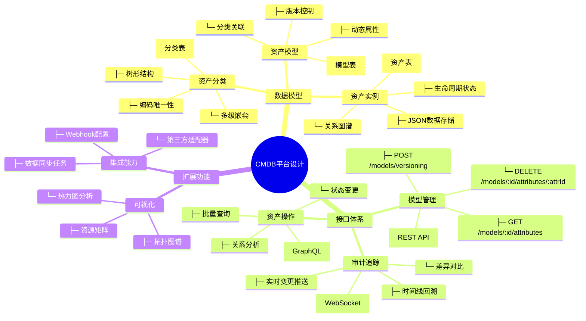

---
title: "资产管理模型设计"
weight: 50
date: 2026-06-05
tags: ["Go", "资产管理", "架构设计"]
---

## CMDB 表结构总结


```go
package cmdb

import (
	"gorm.io/gorm"
	"time"
)

// 自定义表名
const (
	AssetModelTableName          = "asset_models"
	AssetModelCategoryTableName  = "asset_model_categories"
	AssetModelAttributeTableName = "asset_model_attributes"
	AssetTableName               = "assets_data"
	AssetRelationTableName       = "asset_relations"
	AssetChangeHistoryTableName  = "asset_change_history"
)

// DataType 数据类型
type DataType string

const (
	DefaultDataType DataType = "string"
)

// RelationType 关系类型
type RelationType string

const (
	DefaultRelationType RelationType = "OneToOne"
)

// BaseModel 基本表字段
type BaseModel struct {
	ID          uint           `gorm:"column:id;primaryKey;autoIncrement:true;comment:主键" json:"id"`                                          // 软删除标记
	CreatedAt   time.Time      `gorm:"column:created_at;not null;autoCreateTime;default:CURRENT_TIMESTAMP(3);comment:创建时间" json:"created_at"` // 创建时间
	UpdatedAt   time.Time      `gorm:"column:updated_at;not null;autoUpdateTime;default:CURRENT_TIMESTAMP(3);comment:更新时间" json:"updated_at"` // 更新时间
	DeletedAt   gorm.DeletedAt `gorm:"column:deleted_at;index;comment:软删除时间" json:"-" swaggertype:"primitive,string"`                         // 软删除时间
	Description string         `gorm:"type:varchar(256); column:description;comment: 备注信息" json:"description"`                                //  备注信息
}

```


### 1. asset_model_categories (模型分类表)

**描述信息**：存储资产模型的分类信息，支持多级分类结构

**字段**:

- `id`: 主键ID
- `parent_id`: 父分类ID，用于构建树形结构
- `name`: 分类名称
- `code`: 分类编码(唯一)
- `description`: 分类描述
- `icon`: 分类图标URL
- `sort`: 排序权重
- `created_at`: 创建时间
- `updated_at`: 更新时间
- `deleted_at`: 软删除时间

```sql
CREATE TABLE `asset_model_categories` (
  `id` bigint(20) unsigned NOT NULL AUTO_INCREMENT,
  `created_at` datetime(3) DEFAULT NULL,
  `updated_at` datetime(3) DEFAULT NULL,
  `deleted_at` datetime(3) DEFAULT NULL,
  `parent_id` bigint(20) unsigned DEFAULT NULL COMMENT '父分类ID',
  `name` varchar(100) NOT NULL COMMENT '分类名称',
  `code` varchar(50) NOT NULL COMMENT '分类编码',
  `description` text COMMENT '分类描述',
  `icon` varchar(255) DEFAULT NULL COMMENT '分类图标',
  `sort` bigint(20) DEFAULT '0' COMMENT '排序',
  PRIMARY KEY (`id`),
  UNIQUE KEY `idx_asset_model_categories_code` (`code`),
  KEY `idx_asset_model_categories_deleted_at` (`deleted_at`),
  KEY `idx_asset_model_categories_parent_id` (`parent_id`)
) ENGINE=InnoDB DEFAULT CHARSET=utf8mb4 COLLATE=utf8mb4_0900_ai_ci;
```


```go
// AssetModelCategory 模型类别
type AssetModelCategory struct {
	gorm.Model
	ParentID    *uint                `gorm:"type:bigint;index;comment:父分类ID" json:"parent_id" form:"parent_id" query:"parent_id"`
	Name        string               `gorm:"type:varchar(100);not null;comment:分类名称" json:"name" form:"name" query:"name"`
	Code        string               `gorm:"type:varchar(50);uniqueIndex;not null;comment:分类编码" json:"code" form:"code" query:"code"`
	Description string               `gorm:"type:text;comment:分类描述" json:"description" form:"description" query:"description"`
	Icon        string               `gorm:"type:varchar(255);comment:分类图标" json:"icon" form:"icon" query:"icon"`
	Sort        int                  `gorm:"type:int;default:0;comment:排序" json:"sort" form:"sort" query:"sort"`
	Parent      *AssetModelCategory  `gorm:"foreignKey:ParentID;references:ID;comment:父分类" json:"parent" form:"parent" query:"parent"`
	Children    []AssetModelCategory `gorm:"foreignKey:ParentID;references:ID;comment:子分类列表" json:"children" form:"children" query:"children"`
	Models      []AssetModel         `gorm:"foreignKey:CategoryID;references:ID;comment:关联模型列表" json:"models" form:"models" query:"models"`
}

func (*AssetModelCategory) TableName() string {
	return AssetModelCategoryTableName
}
```


### 2. asset_models (资产模型表)

**描述信息**：定义资产的数据模型结构

**字段**:

- `id`: 主键ID
- `name`: 模型展示名称
- `code`: 模型编码(唯一)
- `icon`: 模型图标URL
- `category_id`: 所属分类ID
- `description`: 模型描述
- `created_at`: 创建时间
- `updated_at`: 更新时间
- `deleted_at`: 软删除时间


```sql
CREATE TABLE `asset_models` (
  `id` bigint(20) unsigned NOT NULL AUTO_INCREMENT COMMENT '主键',
  `created_at` datetime(3) NOT NULL DEFAULT CURRENT_TIMESTAMP(3) COMMENT '创建时间',
  `updated_at` datetime(3) NOT NULL DEFAULT CURRENT_TIMESTAMP(3) COMMENT '更新时间',
  `deleted_at` datetime(3) DEFAULT NULL COMMENT '软删除时间',
  `description` varchar(256) DEFAULT NULL COMMENT ' 备注信息',
  `name` varchar(128) NOT NULL COMMENT '模型展示名称',
  `code` varchar(64) NOT NULL COMMENT '模型编码',
  `icon` varchar(256) DEFAULT NULL COMMENT '模型图标',
  `enabled` tinyint(1) DEFAULT '1' COMMENT '是否启用',
  `category_id` bigint(20) unsigned DEFAULT NULL COMMENT '所属分类ID',
  PRIMARY KEY (`id`),
  UNIQUE KEY `idx_asset_models_code` (`code`),
  KEY `idx_asset_models_deleted_at` (`deleted_at`),
  KEY `idx_asset_models_category_id` (`category_id`)
) ENGINE=InnoDB DEFAULT CHARSET=utf8mb4 COLLATE=utf8mb4_0900_ai_ci;
```


```go
// AssetModel 资产模型
type AssetModel struct {
	BaseModel
	Name       string                `gorm:"type:varchar(128);not null;comment:模型展示名称" json:"name" form:"name" query:"name"`
	Code       string                `gorm:"type:varchar(64);uniqueIndex;not null;comment:模型编码" json:"code" form:"code" query:"code"`
	Icon       string                `gorm:"type:varchar(256);comment:模型图标" json:"icon" form:"icon" query:"icon"`
	Enabled    bool                  `gorm:"default:true;comment:是否启用" json:"enabled" json:"enabled" form:"enabled" query:"enabled"`
	CategoryID *uint                 `gorm:"type:bigint;index;comment:所属分类ID" json:"category_id" form:"category_id" query:"category_id"`
	Category   *AssetModelCategory   `gorm:"foreignKey:CategoryID;references:ID;comment:所属分类" json:"category" form:"category" query:"category"`
	Attributes []AssetModelAttribute `gorm:"foreignKey:ModelID;references:ID;comment:模型属性列表" json:"attributes" form:"attributes" query:"attributes"`
}

func (*AssetModel) TableName() string {
	return AssetModelTableName
}
```


### 3. asset_model_attributes (模型属性表)

**描述信息**：定义资产模型的属性字段

**字段**:

- `id`: 主键ID
- `model_id`: 关联模型ID
- `name`: 属性名称
- `code`: 属性编码(模型内唯一)
- `data_type`: 数据类型(string/number/boolean/date/datetime)
- `is_required`: 是否必填
- `default_value`: 默认值
- `description`: 属性描述
- `created_at`: 创建时间
- `updated_at`: 更新时间
- `deleted_at`: 软删除时间

```sql
CREATE TABLE `asset_model_attributes` (
  `id` bigint(20) unsigned NOT NULL AUTO_INCREMENT COMMENT '主键',
  `created_at` datetime(3) NOT NULL DEFAULT CURRENT_TIMESTAMP(3) COMMENT '创建时间',
  `updated_at` datetime(3) NOT NULL DEFAULT CURRENT_TIMESTAMP(3) COMMENT '更新时间',
  `deleted_at` datetime(3) DEFAULT NULL COMMENT '软删除时间',
  `description` varchar(256) DEFAULT NULL COMMENT ' 备注信息',
  `model_id` bigint(20) unsigned NOT NULL COMMENT '关联模型ID',
  `name` varchar(128) NOT NULL COMMENT '属性名称',
  `code` varchar(64) NOT NULL COMMENT '属性编码',
  `data_type` varchar(32) NOT NULL COMMENT '数据类型',
  `is_required` tinyint(1) DEFAULT '0' COMMENT '是否必填',
  `default_value` varchar(256) DEFAULT NULL COMMENT '默认值',
  PRIMARY KEY (`id`),
  UNIQUE KEY `model_code` (`code`),
  KEY `idx_asset_model_attributes_deleted_at` (`deleted_at`)
) ENGINE=InnoDB DEFAULT CHARSET=utf8mb4 COLLATE=utf8mb4_0900_ai_ci;
```


```go
// AssetModelAttribute 模型属性
type AssetModelAttribute struct {
	BaseModel
	ModelID      uint     `gorm:"type:bigint;not null;comment:关联模型ID" json:"model_id" form:"model_id" query:"model_id"`
	Name         string   `gorm:"type:varchar(128);not null;comment:属性名称" json:"name" form:"name" query:"name"`
	Code         string   `gorm:"type:varchar(64);uniqueIndex:model_code;not null;comment:属性编码" json:"code" form:"code" query:"code"`
	DataType     DataType `gorm:"type:varchar(32);not null;comment:数据类型" json:"data_type" form:"data_type" query:"data_type"` // (string/number/boolean/date/datetime)
	IsRequired   bool     `gorm:"type:boolean;default:false;comment:是否必填" json:"is_required" form:"is_required" query:"is_required"`
	DefaultValue string   `gorm:"type:varchar(256);comment:默认值" json:"default_value" form:"default_value" query:"default_value"`
}

func (*AssetModelAttribute) TableName() string {
	return AssetModelAttributeTableName
}
```


### 4. assets_data (资产数据表)

**描述信息**：存储具体的资产实例数据

**字段**:

- `id`: 主键ID
- `model_id`: 关联模型ID
- `asset_code`: 资产编码(唯一)
- `asset_data`: 资产数据(JSON格式)
- `status`: 资产状态(active/inactive/retired)
- `owner`: 资产负责人
- `department`: 所属部门
- `location`: 物理位置
- `expire_date`: 有效期
- `purchase_date`: 采购日期
- `created_by`: 创建人
- `updated_by`: 更新人
- `created_at`: 创建时间
- `updated_at`: 更新时间
- `deleted_at`: 软删除时间

```sql
CREATE TABLE `assets_data` (
  `id` bigint(20) unsigned NOT NULL AUTO_INCREMENT COMMENT '主键',
  `created_at` datetime(3) NOT NULL DEFAULT CURRENT_TIMESTAMP(3) COMMENT '创建时间',
  `updated_at` datetime(3) NOT NULL DEFAULT CURRENT_TIMESTAMP(3) COMMENT '更新时间',
  `deleted_at` datetime(3) DEFAULT NULL COMMENT '软删除时间',
  `description` varchar(256) DEFAULT NULL COMMENT ' 备注信息',
  `model_id` bigint(20) unsigned NOT NULL COMMENT '关联模型ID',
  `asset_code` varchar(100) NOT NULL COMMENT '资产编码',
  `asset_data` json NOT NULL COMMENT '资产数据(JSON格式)',
  `status` varchar(20) DEFAULT 'active' COMMENT '状态(active/inactive/retired)',
  `location` varchar(128) DEFAULT NULL COMMENT '资产位置',
  `expire_date` datetime DEFAULT NULL COMMENT '有效期',
  `tags` json DEFAULT NULL COMMENT '资产标签(JSON数组)',
  PRIMARY KEY (`id`),
  UNIQUE KEY `idx_assets_data_asset_code` (`asset_code`),
  KEY `idx_assets_data_deleted_at` (`deleted_at`),
  KEY `idx_assets_data_model_id` (`model_id`)
) ENGINE=InnoDB DEFAULT CHARSET=utf8mb4 COLLATE=utf8mb4_0900_ai_ci;
```


```go
// Asset 资产实例
type Asset struct {
	BaseModel
	ModelID    uint            `gorm:"type:bigint;not null;index;comment:关联模型ID" json:"model_id" form:"model_id" query:"model_id"`
	AssetCode  string          `gorm:"type:varchar(100);uniqueIndex;not null;comment:资产编码" json:"asset_code" form:"asset_code" query:"asset_code"`
	AssetData  datatypes.JSON  `gorm:"type:json;not null;comment:资产数据(JSON格式)" json:"asset_data" form:"asset_data" query:"asset_data"`
	Status     string          `gorm:"type:varchar(20);default:'active';comment:状态(active/inactive/retired)" json:"status" form:"status" query:"status"`
	Location   string          `gorm:"type:varchar(128);comment:资产位置" json:"location" form:"location" query:"location"`
	ExpireDate time.Time       `gorm:"type:datetime;comment:有效期" json:"expire_date" form:"expire_date" query:"expire_date"`
	Tags       datatypes.JSON  `gorm:"type:json;comment:资产标签(JSON数组)" json:"tags" form:"tags" query:"tags"`
	Model      AssetModel      `gorm:"foreignKey:ModelID;references:ID;comment:关联模型" json:"model" form:"model" query:"model"`
	Relations  []AssetRelation `gorm:"foreignKey:SourceAssetID;comment:关联关系列表" json:"relations" form:"relations" query:"relations"`
}

func (*Asset) TableName() string {
	return AssetTableName
}
```


### 5. asset_relations (资产关系表)

**描述信息**：记录资产之间的关联关系

**字段**:

- `id`: 主键ID
- `source_asset_id`: 源资产ID
- `target_asset_id`: 目标资产ID
- `relation_type`: 关系类型
- `relation_data`: 关系附加数据(JSON格式)
- `created_at`: 创建时间
- `updated_at`: 更新时间
- `deleted_at`: 软删除时间

```sql
CREATE TABLE `asset_relations` (
  `id` bigint(20) unsigned NOT NULL AUTO_INCREMENT COMMENT '主键',
  `created_at` datetime(3) NOT NULL DEFAULT CURRENT_TIMESTAMP(3) COMMENT '创建时间',
  `updated_at` datetime(3) NOT NULL DEFAULT CURRENT_TIMESTAMP(3) COMMENT '更新时间',
  `deleted_at` datetime(3) DEFAULT NULL COMMENT '软删除时间',
  `description` varchar(256) DEFAULT NULL COMMENT ' 备注信息',
  `source_asset_id` bigint(20) unsigned NOT NULL COMMENT '源资产ID',
  `target_asset_id` bigint(20) unsigned NOT NULL COMMENT '目标资产ID',
  `relation_type` varchar(64) NOT NULL COMMENT '关系类型',
  `relation_data` json DEFAULT NULL COMMENT '关系附加数据(JSON格式)',
  PRIMARY KEY (`id`),
  KEY `idx_asset_relations_deleted_at` (`deleted_at`),
  KEY `idx_asset_relations_source_asset_id` (`source_asset_id`),
  KEY `idx_asset_relations_target_asset_id` (`target_asset_id`)
) ENGINE=InnoDB DEFAULT CHARSET=utf8mb4 COLLATE=utf8mb4_0900_ai_ci;
```


```go
// AssetRelation 资产关系
type AssetRelation struct {
	BaseModel
	SourceAssetID uint           `gorm:"type:bigint;not null;index;comment:源资产ID" json:"source_asset_id" form:"source_asset_id" query:"source_asset_id"`
	TargetAssetID uint           `gorm:"type:bigint;not null;index;comment:目标资产ID" json:"target_asset_id" form:"target_asset_id" query:"target_asset_id"`
	RelationType  RelationType   `gorm:"type:varchar(64);not null;comment:关系类型" json:"relation_type" form:"relation_type" query:"relation_type"`
	RelationData  datatypes.JSON `gorm:"type:json;comment:关系附加数据(JSON格式)" json:"relation_data" form:"relation_data" query:"relation_data"`
	SourceAsset   Asset          `gorm:"foreignKey:SourceAssetID;references:ID;comment:源资产" json:"source_asset" form:"source_asset" query:"source_asset"`
	TargetAsset   Asset          `gorm:"foreignKey:TargetAssetID;references:ID;comment:目标资产" json:"target_asset" form:"target_asset" query:"target_asset"`
}

func (*AssetRelation) TableName() string {
	return AssetRelationTableName
}

```


### 6. asset_change_history (资产变更历史表)

**描述信息**：记录资产的所有变更历史

**字段**:

- `id`: 主键ID
- `asset_id`: 关联资产ID
- `operation_type`: 操作类型(create/update/delete/status_change)
- `changed_by`: 操作人
- `change_reason`: 变更原因
- `before_data`: 变更前数据(JSON格式)
- `after_data`: 变更后数据(JSON格式)
- `changed_fields`: 变更的字段列表(JSON数组格式)
- `operation_time`: 操作时间
- `change_type`: 变更类型(属性变更/状态变更/关系变更)
- `change_scope`: 变更范围(全部/部分)
- `created_at`: 创建时间
- `updated_at`: 更新时间
- `deleted_at`: 软删除时间


```sql
CREATE TABLE `asset_change_history` (
  `id` bigint(20) unsigned NOT NULL AUTO_INCREMENT COMMENT '主键',
  `created_at` datetime(3) NOT NULL DEFAULT CURRENT_TIMESTAMP(3) COMMENT '创建时间',
  `updated_at` datetime(3) NOT NULL DEFAULT CURRENT_TIMESTAMP(3) COMMENT '更新时间',
  `deleted_at` datetime(3) DEFAULT NULL COMMENT '软删除时间',
  `description` varchar(256) DEFAULT NULL COMMENT ' 备注信息',
  `asset_id` bigint(20) unsigned NOT NULL COMMENT '关联资产ID',
  `operation_type` varchar(20) NOT NULL COMMENT '操作类型(create/update/delete/status_change)',
  `changed_by` varchar(100) NOT NULL COMMENT '操作人',
  `change_reason` varchar(255) DEFAULT NULL COMMENT '变更原因',
  `before_data` json DEFAULT NULL COMMENT '变更前数据(JSON格式)',
  `after_data` json DEFAULT NULL COMMENT '变更后数据(JSON格式)',
  `changed_fields` json DEFAULT NULL COMMENT '变更的字段列表(JSON数组格式)',
  `operation_time` datetime NOT NULL COMMENT '操作时间',
  PRIMARY KEY (`id`),
  KEY `idx_asset_change_history_deleted_at` (`deleted_at`),
  KEY `idx_asset_change_history_asset_id` (`asset_id`),
  KEY `idx_asset_change_history_operation_type` (`operation_type`),
  KEY `idx_asset_change_history_operation_time` (`operation_time`)
) ENGINE=InnoDB DEFAULT CHARSET=utf8mb4 COLLATE=utf8mb4_0900_ai_ci;
```


```go

// AssetChangeHistory 资产变更历史记录
type AssetChangeHistory struct {
	BaseModel
	AssetID       uint           `gorm:"type:bigint;not null;index;comment:关联资产ID" json:"asset_id" form:"asset_id" query:"asset_id"`
	OperationType string         `gorm:"type:varchar(20);not null;index;comment:操作类型(create/update/delete/status_change)" json:"operation_type" form:"operation_type" query:"operation_type"`
	ChangedBy     string         `gorm:"type:varchar(100);not null;comment:操作人" json:"changed_by" form:"changed_by" query:"changed_by"`
	ChangeReason  string         `gorm:"type:varchar(255);comment:变更原因" json:"change_reason" form:"change_reason" query:"change_reason"`
	BeforeData    datatypes.JSON `gorm:"type:json;comment:变更前数据(JSON格式)" json:"before_data" form:"before_data" query:"before_data"`
	AfterData     datatypes.JSON `gorm:"type:json;comment:变更后数据(JSON格式)" json:"after_data" form:"after_data" query:"after_data"`
	ChangedFields datatypes.JSON `gorm:"type:json;comment:变更的字段列表(JSON数组格式)" json:"changed_fields" form:"changed_fields" query:"changed_fields"`
	OperationTime time.Time      `gorm:"type:datetime;not null;index;comment:操作时间" json:"operation_time" form:"operation_time" query:"operation_time"`

	Asset Asset `gorm:"foreignKey:AssetID;references:ID;comment:关联资产" json:"asset" form:"asset" query:"asset"`
}

func (*AssetChangeHistory) TableName() string {
	return AssetChangeHistoryTableName
}

```


## 主要实现表的核心字段

1. **分类表核心字段**：
   - `parent_id`: 实现多级分类
   - `code`: 唯一业务标识
   - `sort`: 控制展示顺序
2. **模型表核心字段**：
   - `code`: 模型唯一标识
   - `category_id`: 分类归属
   - 与属性表一对多关联
3. **资产表核心字段**：
   - `model_id`: 模型关联
   - `asset_code`: 资产唯一标识
   - `asset_data`: 存储动态属性数据(JSON)
   - `status`: 生命周期状态
4. **关系表核心字段**：
   - `source_asset_id`/`target_asset_id`: 建立资产关联
   - `relation_type`: 定义关系类型
   - `relation_data`: 存储关系元数据
5. **变更历史表核心字段**：
   - `asset_id`: 关联资产
   - `before_data`/`after_data`: 数据变更快照
   - `changed_fields`: 精确记录变更点





